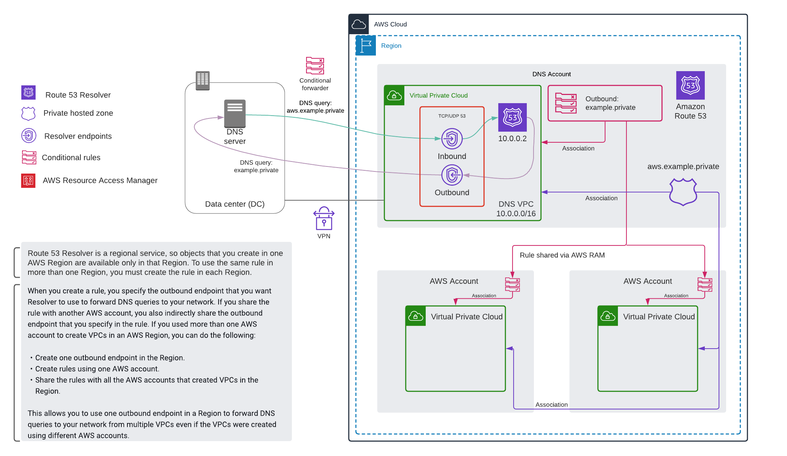

# Hybrid DNS Simulation

## Overview

This environment is an artifact from time spent exploring how to deploy a hybrid DNS environment for a customer.  In simulating the environment I was able to note nuances and demonstrate how to meet their requirements in their specific environment.

Since it was a time consuming effort and there are many [AWS CloudFormation](https://aws.amazon.com/cloudformation/) resources that needed to be created, I wanted to preserve it and make it public for others to utilize.

All you need is an AWS account (two if you want to explore a multi-account environment) and an hour or so to learn.

I've provided [guidance](guided-learning.md) that will direct you through some of the learning process, making this a bit of a lab as well as a reference architecture.

---

### Scenario

Institution owns a data center (DC) with a private network.  Within, it hosts authoritative DNS resolvers for its private domain (e.g. `example.private`).

They have multiple AWS accounts in their environment with workloads distributed among them.  They want to enable resolution of private DNS names between their DC and all AWS accounts under their control.

The VPCs do not have network connectivity between each other.

There is an [AWS VPN](https://aws.amazon.com/vpn/) (or [AWS Direct Connect](https://aws.amazon.com/directconnect)) between their DC and their AWS environment, attached to the DNS VPC.

Design tenets:

* Implementation complexity should be low
* Management overhead must be low
* Resiliency must be high
* Must be scalable
* Must be cost effective

---

## Related documentation

* [Resolving DNS queries between VPCs and your network](https://docs.aws.amazon.com/Route53/latest/DeveloperGuide/resolver.html)
* [Hybrid Cloud DNS Options for Amazon VPC](https://d1.awsstatic.com/whitepapers/hybrid-cloud-dns-options-for-vpc.pdf)
  * When I created this sim, the whitepaper was current as of *November 2019* and at that time query logging wasn't directly supported.  This capability was added in 2020
    * [Log your VPC DNS queries with Route 53 Resolver Query Logs](https://aws.amazon.com/blogs/aws/log-your-vpc-dns-queries-with-route-53-resolver-query-logs/)
    * [Resolver query logging](https://docs.aws.amazon.com/Route53/latest/DeveloperGuide/resolver-query-logs.html)

---

## Simulation

There are many parameters specified in the CloudFormation template, and each of them has a configured default.  You should leave the values as they are when you deploy the stack.  The default values are referenced as examples below.  

**This scenario has been tested with the default values, if you opt to change them, you're on your own**

Deploying this stack will incur AWS costs.  There are three [t3](https://aws.amazon.com/ec2/instance-types/t3/).micro instances, a [NAT gateway](https://docs.aws.amazon.com/vpc/latest/userguide/vpc-nat-gateway.html), and Route 53 Resolver endpoints (containing 4 [ENI](https://docs.aws.amazon.com/AWSEC2/latest/UserGuide/using-eni.htmls)), this is not a full list of resources deployed.  **Be sure that you delete the stack when you're done learning**.

---

### On premises data center

This is simulated with an [AWS VPC](https://aws.amazon.com/vpc/).  Within the VPC, there are two recursive DNS servers based on [unbound](https://www.nlnetlabs.nl/projects/unbound/about/); `ns1.example.private` & `ns2.example.private`.

* These servers are authoritative for the `example.private` domain
* Unbound will forward queries for `aws.example.private` to an endpoint in AWS that will resolve records for that zone (more on this below)
* Unbound will forward queries for other domains (e.g. public domain names and [EC2](https://aws.amazon.com/ec2/) private names) to the Amazon provided DNS server at the base of the VPC IPv4 network range plus two (e.g. 172.30.0.2)

*Note: The VPC is based on a template I re-use frequently it deploys resources that I like to have around.  These resources aren't explained or referenced below*

#### *Shell access*

Access to the instances in this sim is provided via [AWS Systems Manager Session Manager](https://docs.aws.amazon.com/systems-manager/latest/userguide/session-manager.html)

You can work with Session Manager in the following ways:

The [AWS Systems Manager console](https://console.aws.amazon.com/systems-manager) includes access to all the Session Manager capabilities for both administrators and end users. You can perform any task that's related to your sessions by using the Systems Manager console.

The [Amazon EC2 console](https://console.aws.amazon.com/ec2/) provides the ability for end users to connect to the EC2 instances for which they have been granted session permissions.

*Tip: If you're new to this, simply go to the [EC2 console](https://console.aws.amazon.com/ec2/), select the instance, click the *Connect* button, and use the guidance provided to gain access.*

The AWS CLI includes access to Session Manager capabilities for end users. You can start a session, view a list of sessions, and permanently end a session by using the AWS CLI.

---

### DNS services VPC

It's common to dedicate an AWS account to shared services (such as DNS, directory, etc) and make those services available to other AWS accounts in your environment.  In this simulation, the only shared service is DNS.  

This VPC will have a [Amazon Linux 2](https://aws.amazon.com/amazon-linux-2/) instance (`dns-vpc-client.aws.example.private`) that is used to test DNS resolution between the AWS cloud and the data center.

This VPC is peered with the DC VPC and there are routes between the networks.  This simulates a VPN connection.

*Note: The VPC is based on a template I re-use frequently it deploys resources that I like to have around.  These resources aren't explained or referenced below*

#### Shell access

As explained above, access to the instances in this sim is provided via [AWS Systems Manager Session Manager](https://docs.aws.amazon.com/systems-manager/latest/userguide/session-manager.html)

---

### Route 53 resources

Various [Route 53](https://aws.amazon.com/route53/) resources exist:

* [Private hosted zone](https://docs.aws.amazon.com/Route53/latest/DeveloperGuide/hosted-zones-private.html) (PHZ) for the `aws.example.private` domain
* [Resolver endpoints](https://docs.aws.amazon.com/Route53/latest/DeveloperGuide/resolver.html) for resolving DNS queries between VPCs and DC
  * While all of the endpoint IP addresses are static in this sim, it's only a best practice to specify the addresses for the *incoming* endpoints
* [Forwarding rule(s)](https://docs.aws.amazon.com/Route53/latest/DeveloperGuide/resolver-rules-managing.html) that determine which queries are sent to the DC for resolution
* Query logging is enabled for resources within the VPC (EC2 instances, [Lambda](https://aws.amazon.com/lambda/) functions, etc).  The logs are shipped to [CloudWatch Logs](https://docs.aws.amazon.com/AmazonCloudWatch/latest/logs/WhatIsCloudWatchLogs.html)

The PHZ and forwarding rule(s) are associated with the DNS services VPC.  This ensures that Route 53 Resolver can resolve records in that zone and process the rule(s).

> When you create a VPC using Amazon VPC, Route 53 Resolver automatically answers DNS queries for local VPC domain names for EC2 instances (ec2-192-0-2-44.compute-1.amazonaws.com) and records in private hosted zones (acme.example.com). For all other domain names, Resolver performs recursive lookups against public name servers.  You also can integrate DNS resolution between Resolver and your data center.

---

## Deploy

1. Clone this repository
2. Navigate to the [AWS CloudFormation](https://console.aws.amazon.com/cloudformation/) console
3. Click *Create stack*
4. Select *Upload a template file*
5. Click *Choose file* and navigate to and select the [hybrid-dns.yaml](templates/hybrid-dns.yaml) template on your filesystem
6. Click *Next*
7. Name the stack (e.g. `hybrid-dns`)
8. Click *Next* twice
9. Under *Capabilities* check on the *"I acknowledge that AWS CloudFormation might create IAM resources."* box
  * There is an IAM instance profile that facilitates AWS Systems Manager Session Manager access to the instances
10. Click *Create stack*

---

## Explore

Review the resources that were created, the documentation referenced above and start learning.

For a lab-like experience, [start here](guided-learning.md)