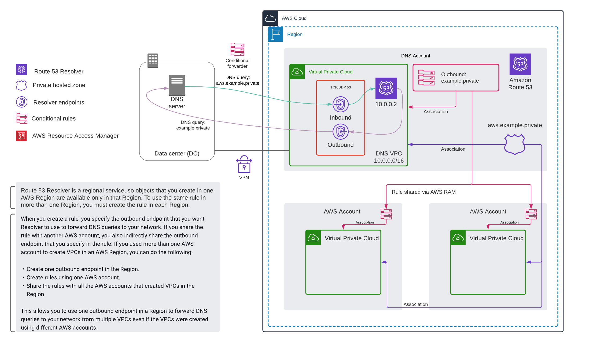

# Hybrid DNS: Guided Learning

This guide assumes you've successfully deployed the stack and that you have the equivalent of AdministratorAccess in the accounts you're operating in

---

## Resolve records (VPC <--> DC)

### Resolution of private records associated with DNS VPC

* Log into `dns-vpc-client.aws.example.private` (using AWS Systems Manager Session Manager)
* `dig dns-vpc-client.aws.example.private`
  * Note the record is of type CNAME and resolves to the EC2 private DNS name of the instance
    * The record is configured in the Route 53 (R53) `aws.example.private` private hosted zone (PHZ)
    * There are other records `[a-e].aws.example.private` for further exploration
  * Note that the resolution is provided by the Amazon provided DNS server (Route 53 Resolver) at *10.0.0.2*

### Resolution of records hosted by DC authoritative resolvers

This is most instructive if you log into `ns1` and `ns2` and follow the log file for unbound: `tail -f /var/log/unbound`

* Log into `dns-vpc-client.aws.example.private`
* `dig ns1.example.private`
  * Note the record is of type A and resolves to the IP address of `ns1`
  * Note that the resolution is provided by the Amazon provided DNS server (Route 53 Resolver) at *10.0.0.2*
    * By following the unbound log, you will see that one of the DC resolvers actually fielded the request
  * There are other records `[a-e].example.private` for further exploration

The `dns-vpc-client` sent the resolution request to the 10.0.0.2 resolver, the associated outbound rule for the `example.private` domain was processed and the request was forwarded to the DC resolvers which are authoritative for the `example.private` domain.  They provided a response to the 10.0.0.2 resolver, which in turn responded to `dns-vpc-client`

---

## Extend resolution to default VPC in same account

*By following these steps, you're creating a drift from your CloudFormation stack.  Reverse these changes before attempting to remove the stack*

* Launch a new instance in your default VPC (or another VPC suitable for testing)
* Log into the instance
* `dig ns1.example.private`
  * DNS resolution fails, the R53 conditional rule is not associated with the VPC
* Navigate to the [Route 53 console](https://console.aws.amazon.com/route53/)
  * Under *Resolver*, select *Rules*
  * Click the *Data Center Resolver* rule
  * Click the *Associate VPC* button, select the default VPC from the list and click *Add*
  * Repeat the process for the *Data Center Reverse Resolver* if desired
* Log into both `ns1` and `ns2` then `tail -f /var/log/unbound`
* Re-run the dig command on the instance in the default VPC
  * Note that resolution succeeded, and as expected the resolvers in the DC fielded the request
* Now run `dig a.aws.example.private`
  * Once again, resolution succeeded.  The important detail to note here is that the DC resolvers were used to field the request, this is not desirable

In addition to associating the R53 conditional rule with the VPC, you also need to associate the PHZ.  

If you skip this step, this VPC becomes dependent on the VPN and the DC resolvers for name resolution of both `example.private` and `aws.example.private`. 

* Navigate to the [Route 53 console](https://console.aws.amazon.com/route53/)
  * Under *Resolver*, select *Hosted zones*
  * Click the *aws.example.private* rule
  * Click the *Edit* button in the *Hosted zone details* box
  * Click *Add VPC*
    * Select your region
    * Select the default VPC
    * Click *Save changes*
* From the instance in the default VPC, run `dig b.aws.example.private`
  * Note that resolution succeeds and the query was resolved by R53, not the DC resolvers

---

## Extend resolution to default VPC in another account

*By following these steps, you're creating a drift from your CloudFormation stack.  Reverse these changes before attempting to remove the stack*

For this activity, you'll need a second AWS account with a default VPC (or another VPC suitable for testing) in the same region where you have configured your R53 resolver endpoints

The *Source account* is the account where the R53 Resolver endpoints are configured, the *Destination account* is the account you're extending DNS resolution to

For more information about sharing PHZs across accounts, see [How do I associate a Route 53 private hosted zone with a VPC on a different AWS account?](https://aws.amazon.com/premiumsupport/knowledge-center/private-hosted-zone-different-account/)

Before getting started, collect the following:

* Hosted zone ID of the `aws.example.private` PHZ
* VPC ID of the default VPC in the destination account
* The region you're operating in

At the end of this activity, the architecture will resemble with this diagram (sharing with one account, not two):

### Share the rule and authorize VPC association for the destination account

* In the source account, navigate to the [Resource Access Manager console](https://console.aws.amazon.com/ram/)
* Click the *Create a resource share* button
  * Enter a name for the share
  * Select *Resolver Rules* from the drop-down
  * Choose both *Data Center Resolver* and *Data Center Reverse Resolver*
  * In the *Principals - optional* section enter the account ID of destination account
  * Click *Create resource share*
* In the source account, navigate to the [Cloud Shell console](https://console.aws.amazon.com/cloudshell/)
  * Enter the following, replace $PHZID, $VPCID, and $REGION with actual values: `aws route53 create-vpc-association-authorization --hosted-zone-id $PHZID --vpc VPCRegion=$REGION,VPCId=$VPCID`

### Accept the share and associate the PHZ and rules in the destination account

* In the destination account, navigate to the [Resource Access Manager console](https://console.aws.amazon.com/ram/)
  * Under *Shared with me*, click *Resource shares*
  * Click on the share you created previously, then click *Accept resource share*, confirm when prompted
* In the destination account, Navigate to the [Route 53 console](https://console.aws.amazon.com/route53/)
  * Under *Resolver*, select *Rules*
  * Click the *Data Center Resolver* rule
  * Click the *Associate VPC* button, select the default VPC from the list and click *Add*
  * Repeat the process for the *Data Center Reverse Resolver* if desired
* In the destination account, navigate to the [Cloud Shell console](https://console.aws.amazon.com/cloudshell/)
  * Enter the following, replace $PHZID, $VPCID, and $REGION with actual values: `aws route53 associate-vpc-with-hosted-zone --hosted-zone-id $PHZID --vpc VPCRegion=$REGION,VPCId=$VPC`

### Delete VPC authorization in the source account

* In the source account, navigate to the [Cloud Shell console](https://console.aws.amazon.com/cloudshell/)
  * Enter the following, replace $PHZID, $VPCID, and $REGION with actual values: `aws route53 delete-vpc-association-authorization --hosted-zone-id $PHZID --vpc VPCRegion=$REGION,VPCId=$VPCID`

### Test DNS resolution

* Log into both `ns1` and `ns2` then `tail -f /var/log/unbound`
* In the destination account, launch a new instance in your default VPC
* Log into the instance
* `dig ns1.example.private`
  * Note that resolution succeeded and as expected, the resolvers in the DC fielded the request
* Now run `dig a.aws.example.private`
  * Once again, the resolution succeeded and the response was provided by R53

---

## Notes

### Query logging

Query logging is enabled in the DNS VPC only, and will only apply to resources that exist in that VPC.  You can use the [Route 53 console](https://console.aws.amazon.com/route53/) to enable logging in other VPCs.

### Alternative scenario

This project and guidance applies to a scenario where network connectivity between the DNS VPC and those that have had DNS resolution extended to them, doesn't exist.  If you want to explore further, consider peering or using a transit gateway to establish connectivity.  In this alternative scenario, you will create a new outbound rule for `aws.example.private` with a destination of the R53 Resolver inbound endpoint IPs.  Then share it using RAM (as above).  Accept the share and associate the rule with VPCs in other accounts, this way you can skip the step of associating the PHZ (eliminating some operational overhead).  The infrastructure would look like this:

